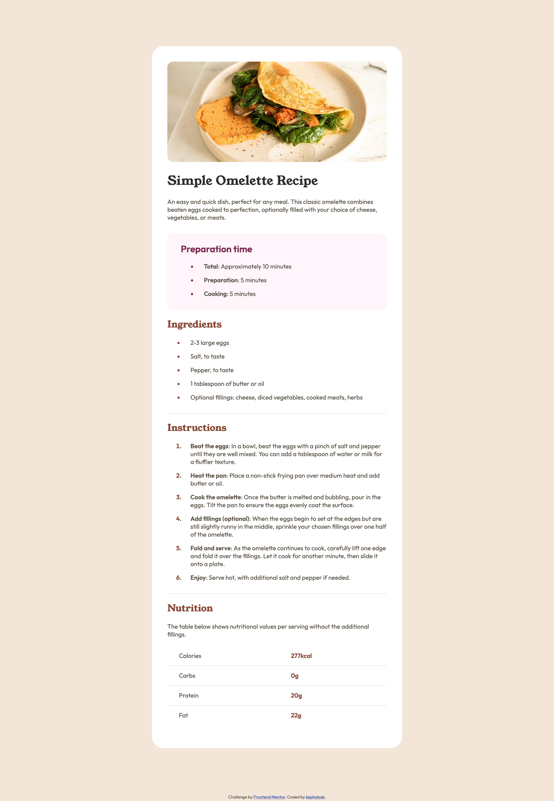
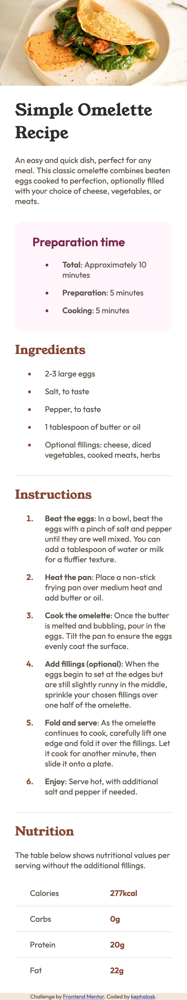

# Frontend Mentor - Recipe page solution

This is a solution to the [Recipe page challenge on Frontend Mentor](https://www.frontendmentor.io/challenges/recipe-page-KiTsR8QQKm). Frontend Mentor challenges help you improve your coding skills by building realistic projects. 

## Table of contents

- [Overview](#overview)
  - [Screenshot](#screenshot)
  - [Links](#links)
- [My process](#my-process)
  - [Built with](#built-with)
  - [What I learned](#what-i-learned)
  - [Continued development](#continued-development)
  - [Useful resources](#useful-resources)
- [Author](#author)
- [Acknowledgments](#acknowledgments)


## Overview

### Screenshot

Desktop 


Mobile


### Links

- Solution URL: [Add solution URL here](https://github.com/kephalosk/recipe-page-main)
- Live Site URL: [Add live site URL here](https://kephalosk.github.io/recipe-page-main/)

## My process

1. check html 
* general structure

2. check css
* image styling
* font styling
* color styling
* frame styling
* distance styling

3. check responsive design


4. check accessability
* semantic html
* headings
* alternative texts
* language
* clear language
* link texts

### Built with

- Semantic HTML5 markup
- CSS custom properties
- Desktop-first workflow

### What I learned

I learned to integrate custom fonts from the asset folder:
```css
@font-face {
  font-family: "Outfit";
  src: url('assets/fonts/outfit/static/Outfit-SemiBold.ttf') format('truetype');
  font-weight: bold;
}
```

I learned that you can include the padding of an element to its width with box-sizing:
```css
* {
  box-sizing: border-box;
}
```

### Continued development

* improve html
* improve css

### Useful resources

- [w3schools](https://www.w3schools.com/) - HTML and CSS knowledge
- [selfhtml](https://wiki.selfhtml.org/wiki/HTML) - HTML knowledge

## Author

- Website - [kephalosk](https://easywebpath.com)
- Frontend Mentor - [@yourusername](https://www.frontendmentor.io/profile/yourusername)
- Twitter - [@yourusername](https://www.twitter.com/yourusername)

## Acknowledgments

None.